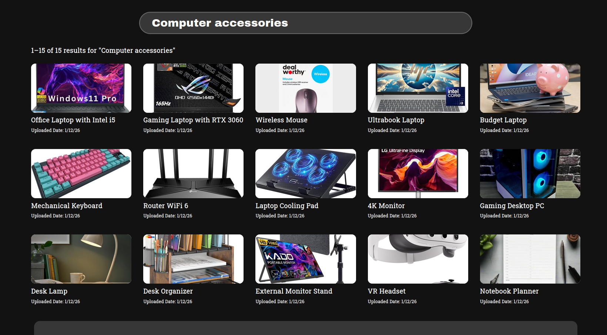
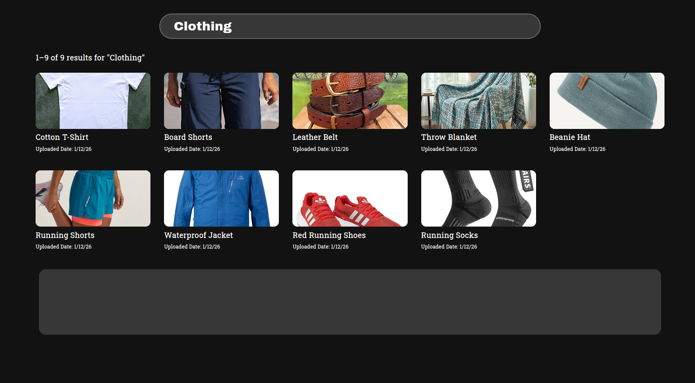
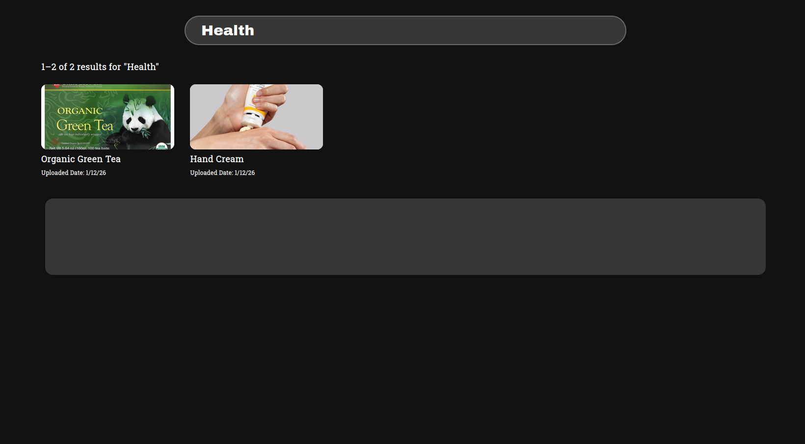

# ML Twin-Tower Recommendation System – Design Flow

## Overview
This system generates product recommendations using semantic embeddings, vector normalization, approximate nearest neighbor (ANN) search, and cross-encoder re-ranking.

| Screenshot 1 | Screenshot 2 | Screenshot 3 |
|-------------|-------------|-------------|
|  |  |  |

---

### Models Used

- Embedding Model: **all-MiniLM-L6-v2**
- Normalization Model: **My own Custom-trained model**
- Re-Ranking Model: **cross-encoder/ms-marco-MiniLM-L-6-v2**

---

## System Flow

Offline:
Products → Embedding (768d) → Normalize (384d) → Store

Online:
User Query → Embedding (384d) → Normalize (384d)
           → ANN Search (Top 100)
           → Re-Rank (Cross-Encoder)
           → Return Results

## Key Features

- Semantic search (beyond keyword matching)
- Fast retrieval using ANN
- Improved accuracy via re-ranking
- Low vector storage with reduced dimensions

---
